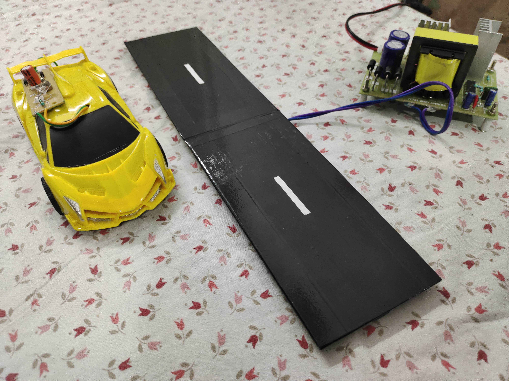
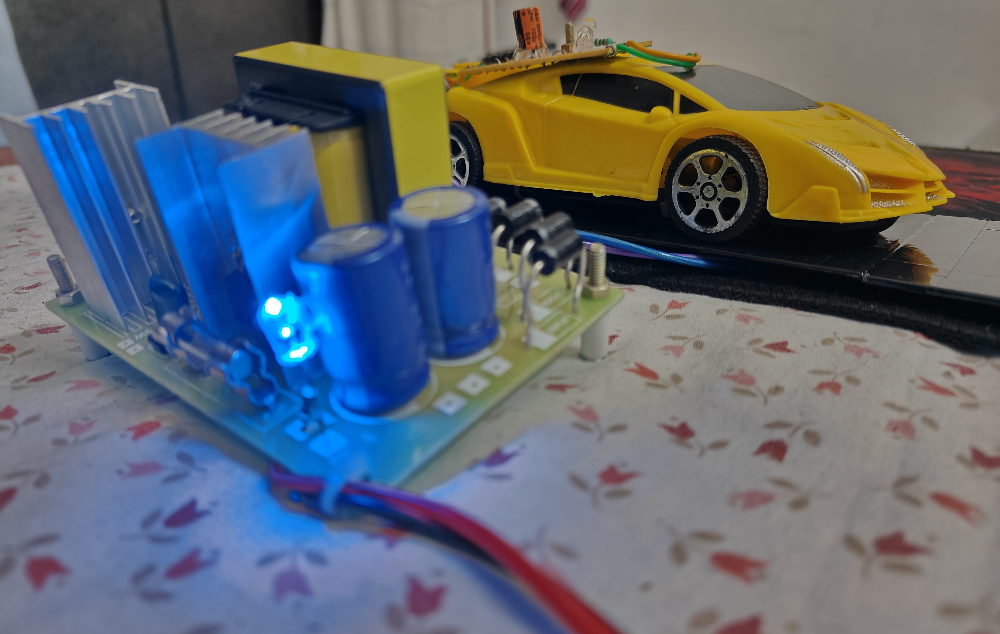

# 🚗 Dynamic Wireless Charging of Electric Vehicles ⚡

🎥 **[Watch Demonstrative Video](https://drive.google.com/file/d/1jiZOiu51J2EZuG3WZIXTAUT8fzhyA_i4/view?usp=sharing)**

## 📌 Project Overview

This project explores Dynamic Wireless Charging for Electric Vehicles (EVs), a cutting-edge technology that uses inductive power transfer to charge EVs while in motion. Unlike traditional plug-in chargers, this approach enhances efficiency and extends driving range without frequent stops.

## 🏗️ How It Works

- **Inductive Coils** are embedded under road surfaces.
- **Power Transmission** occurs wirelessly through electromagnetic fields.
- **Receiving Coils** in EVs capture the energy and charge the battery in real-time.
- **Efficient Energy Transfer** ensures continuous charging without disrupting travel.

## 🎯 Key Features

✅ Continuous wireless charging on the go\
✅ Reduced need for stationary charging stations\
✅ Enhanced EV range and efficiency\
✅ Sustainable energy integration (solar/wind)

## 🛠️ Components Used

- **Transmitter Coil:** Installed beneath roads to generate an alternating magnetic field
- **Receiver Coil:** Mounted on EVs to receive power
- **Resonant Circuits:** Improve energy transfer efficiency
- **Power Electronics:** Regulate and optimize power transmission
- **Embedded Sensors:** Monitor charge levels and system efficiency

## 📈 Potential Applications

- **Highways & Expressways** – Enabling long-distance EV travel
- **Smart Cities** – Seamless integration into urban infrastructure
- **Public Transport** – Wireless charging for buses and taxis

## 🌍 Impact & Future Scope

- Reduces reliance on large EV batteries, making EVs more affordable
- Decreases carbon emissions by promoting electrified transport
- Supports the transition to a more sustainable energy ecosystem
